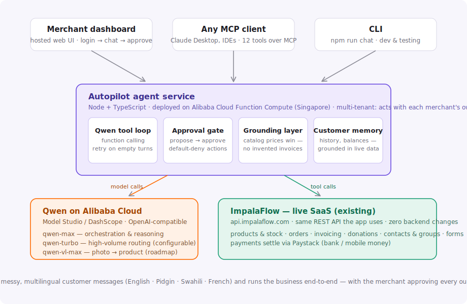

# ImpalaFlow Autopilot

**An AI employee for African micro-merchants — it sells, bills, chases payments, and remembers every customer.** Built on **Qwen (Alibaba Cloud)**, plugged into [ImpalaFlow](https://impalaflow.com), a live commerce SaaS with real merchants.

> Global AI Hackathon with Qwen Cloud — **Track 4: Autopilot Agent**

A customer writes *"abeg send invoice give Ada for 2 bag of rice"* — in English, Pidgin, Swahili, or French, however they actually type. The Autopilot looks up the merchant's **real catalog and stock**, drafts the invoice at **real prices**, and stops at an **approval card**. One tap from the merchant and the invoice is issued, emailed, and payable via Paystack. That's the whole idea: an agent that *runs the business*, with the human approving anything that leaves the building.

## Try it in 30 seconds (no install)

**Live demo:** 👉 **https://proxiex.github.io/impala-autopilot/**

(The UI is a static page on GitHub Pages; every agent request it makes runs on **Alibaba Cloud Function Compute** at `https://impala-utopilot-seirlydawn.ap-southeast-1.fcapp.run` — try its [`/health`](https://impala-utopilot-seirlydawn.ap-southeast-1.fcapp.run/health). FC's default domain forces file downloads on page loads, so the page itself is hosted on Pages.)

Sign in with the demo store (a disposable test tenant in Ghana, GHS):
- Email: `difrentecho+autopilot@gmail.com`
- Password: `Password#0`

Things to ask it:
- *How is my business doing this week?*
- *Invoice Ama (ama.demo@gmail.com) for 2 Bag of Rice 25kg* → approve the card it shows you
- *Chase my unpaid invoices*
- *What's my history with Efua?*
- Paste a messy price list: *"add these: sardine tin 12, peak milk small - 8.5, indomie carton 85 (stock 25)"*

## Architecture



- **Agent service** (this repo, Node + TypeScript): a Qwen function-calling loop over 15 business tools, an approval gate, a deterministic grounding layer, and customer memory. Runs on **Alibaba Cloud Function Compute** (Singapore).
- **Models**: **Qwen via Alibaba Cloud Model Studio (DashScope)** — see [`src/llm/client.ts`](src/llm/client.ts) (*proof of Alibaba Cloud usage: every model call goes through DashScope*).
- **The business layer is real**: the agent drives the same REST API the ImpalaFlow dashboard uses — products, orders, invoicing, donations, contacts, forms — with **zero backend changes**. Payments settle through Paystack.

### Model routing

| Job | Model |
|-----|-------|
| Orchestration & reasoning (demo) | `qwen-max` |
| Development / cheaper iteration | `qwen-plus` |
| High-volume routing & classification (configurable) | `qwen-turbo` |
| Photo → product matching (roadmap) | `qwen-vl-max` |

### Engineering choices judges may care about

1. **Deterministic price grounding.** LLMs invent plausible prices; ours *can't ship one*. Before any invoice reaches the approval preview, every line item is validated against the live catalog — catalog names and prices always win, unknown items bounce back to the model with instructions. The same grounding runs again at execution time (defense in depth), including through MCP.
2. **Propose → approve, default-deny.** Actions (create invoice, send reminder, bulk-create products) never execute directly from model output. The loop captures a proposal with a human-readable preview; a separate authenticated call executes it. No approver present → the action simply doesn't run.
3. **Multi-tenant token mode.** The service holds no merchant credentials. Every request carries the merchant's own short-lived token; the agent acts *as that merchant*, and tenant isolation is enforced by the platform's existing auth.
4. **Memory grounded in business data.** "What's my history with Ada?" is answered from live contacts, invoices, and orders — recall that is always true, with no separate store to drift out of sync.
5. **Channel-aware output.** The same agent returns render-ready JSON blocks (product cards, stat tiles, lists) to the dashboard, and clean prose to text channels.
6. **MCP server.** `npm run mcp` exposes all 15 tools over the Model Context Protocol — Claude Desktop or any MCP client can operate an ImpalaFlow store (with the client's own per-call approval prompts keeping the human in the loop).

## Run it yourself

Requires Node 18+ (`.nvmrc` pins 22).

```bash
git clone https://github.com/proxiex/impala-autopilot.git
cd impala-autopilot
npm install
cp .env.example .env   # add your DashScope API key + an ImpalaFlow login
npm run serve          # dashboard + API on http://localhost:8787
```

Other entry points:

```bash
npm run chat           # interactive CLI (y/N approval prompts)
npm run chat -- "how much stock of rice do I have?"
npm run mcp            # MCP server over stdio (15 tools)
npm run seed           # seed sample products into the tenant
npm run typecheck
```

## Deploying on Alibaba Cloud

The service ships as a container (see [`Dockerfile`](Dockerfile)) and runs on **Function Compute** — full walkthrough in [`DEPLOY.md`](DEPLOY.md). The live demo above is that exact setup: FC (Singapore) pulling `proxiex/impala-autopilot`, calling Qwen through DashScope.

## Security notes

- No credentials are stored by the service — token mode end to end; the demo login above is a disposable test store.
- Secrets live in runtime env vars (never in the image or repo).
- Every outward-facing action requires explicit human approval; price grounding makes invented invoices impossible.
- The agent never touches payment/payout configuration.

## What's next (post-hackathon)

This ships to real ImpalaFlow merchants: WhatsApp as a customer channel, `qwen-vl-max` photo→product quoting, marketing campaign drafting, and payment-recovery loops running on a schedule.

## License

MIT — see [LICENSE](LICENSE).
